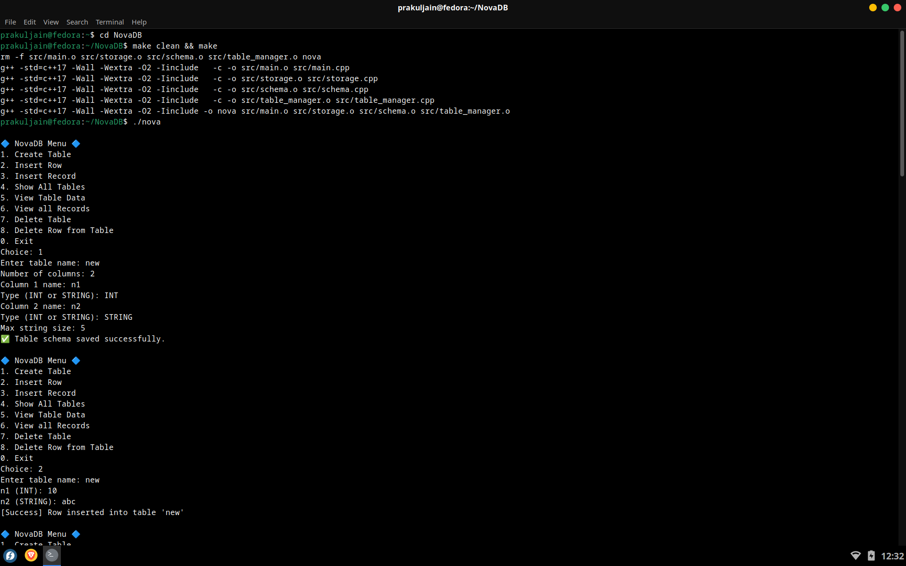
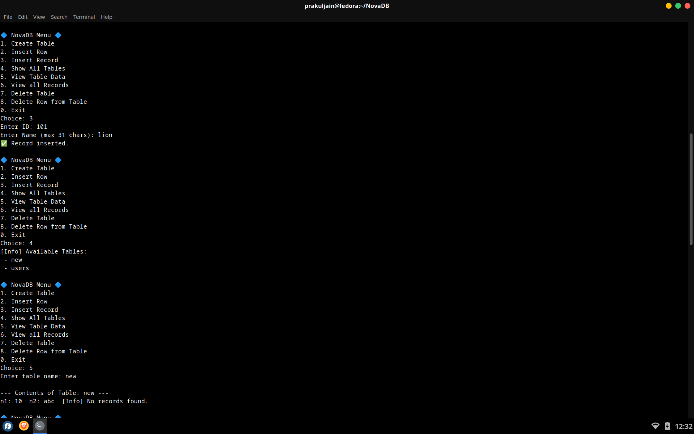
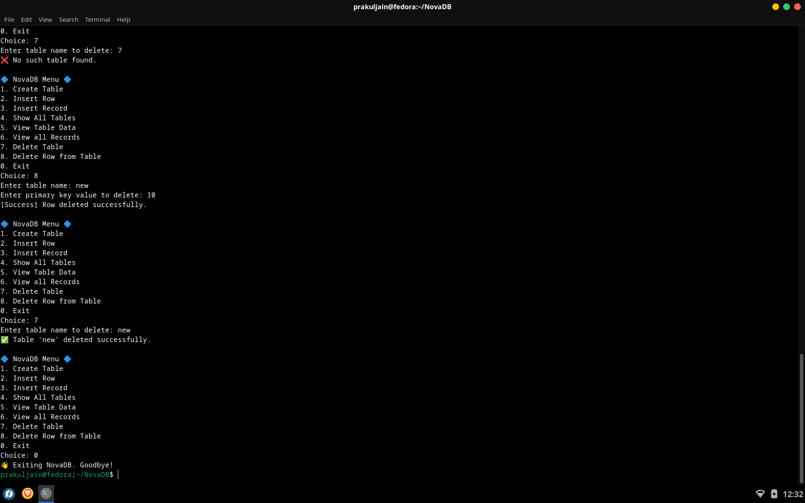

# 🚀 NovaDB – Build Your Own Database and Implement it

NovaDB is a minimal, educational relational database engine written in C++. It supports custom schemas, binary data storage, and basic data manipulation operations like insert, read, and delete — all without relying on external libraries or frameworks.

---

## 🧠 What NovaDB Does

NovaDB simulates the core functionality of a relational database system:

- Create tables with custom column names and data types
- Store structured records in efficient binary format
- View and manage stored data interactively via terminal
- Delete individual tables and list all available tables

---

## ✨ Key Features

✅ **Custom Schema Definition**  
Define any number of tables with dynamic column names and types (`INT`, `STRING`).

📦 **Binary Storage Engine**  
Data is stored in `.bin` files for efficient read/write access.

🧾 **Schema Persistence**  
Each table’s structure is saved as a `.meta` file in the `data/` directory.

🧹 **Table Management**  
Supports full lifecycle operations: create, insert, view, delete, and list tables.

🔒 **Isolated Design**  
No external database engines or libraries — built from scratch in modern C++.

---

## ⚙️ How to Run

### 1. 🔧 Build NovaDB
Bash : make clean && make

### 2. 🔧 Run NovaDB
Bash : ./NovaDB

---

## 📸 Output Preview

